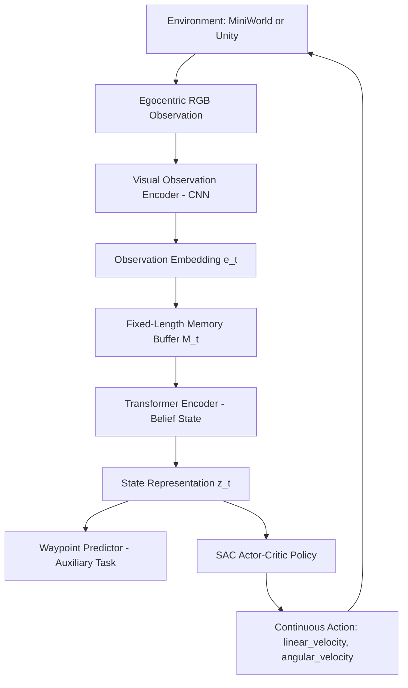
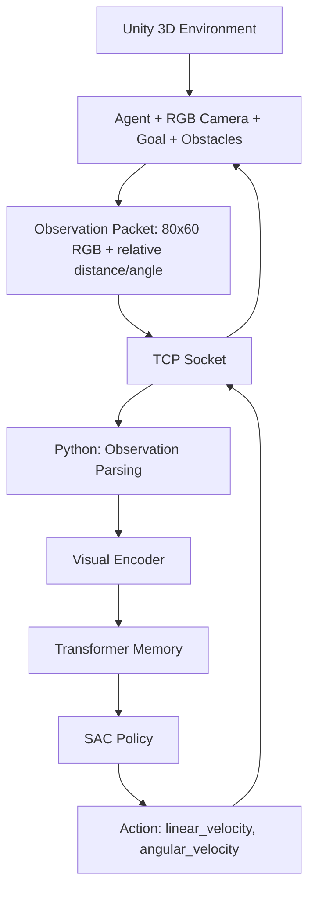

# Transformer Memory for Interactive Visual Navigation: From MiniWorld to Unity 3D

## Overview

This repository implements a **transformer-based temporal memory framework for reinforcement-learning-driven visual navigation**, inspired by Li et al., *"Transformer Memory for Interactive Visual Navigation in Cluttered Environments"* (IEEE RA-L, 2023). The project reproduces the paper's core architectural ideas — a transformer encoder over a fixed-length observation history, a waypoint-prediction auxiliary task, and a SAC-based continuous control policy — in a self-contained MiniWorld environment, and is currently being extended into a more visually realistic and controllable Unity 3D environment.

The project is structured in two stages:

- **Stage 1 (Completed):** A paper-inspired implementation and training/evaluation pipeline in [MiniWorld](https://github.com/Farama-Foundation/MiniWorld).
- **Stage 2 (In Progress):** Migration of the same navigation framework to a custom Unity 3D environment, communicating with the Python RL stack over a TCP interface.

This is a research implementation built for learning, experimentation, and portfolio purposes. It is **not** a certified reproduction of the original paper's experimental results, and the Unity extension is **not yet trained or evaluated**.

---

## Motivation / Research Question

Real indoor environments are rarely static: small, interactable obstacles (shoes, boxes, furniture) force a navigating agent to reason over history to decide whether to go around or push through an obstacle. This partial observability motivates the use of a **temporal memory** mechanism richer than a single-frame observation.

The guiding research question for this project is:

> *Can a transformer-based temporal memory, trained with an auxiliary waypoint-prediction objective, produce an effective and generalizable navigation policy under partial observability — and does this framework remain viable when migrated from a lightweight simulator (MiniWorld) to a more visually complex 3D environment (Unity)?*

---

## Paper / Reference

Li, W., Hong, R., Shen, J., Yuan, L., & Lu, Y. (2023). *Transformer Memory for Interactive Visual Navigation in Cluttered Environments*. IEEE Robotics and Automation Letters, 8(3), 1731–1738.

This repository is **inspired by** the above paper's architecture (belief state encoder, waypoint-prediction surrogate objective, SAC policy). It does not use the original iGibson benchmark, the original Google Scanned Objects assets, or the original evaluation protocol, and no claim of exact reproduction is made.

---

## Project Status

| Component | Status |
|---|---|
| MiniWorld navigation environment | ✅ Completed |
| Visual observation encoder (CNN) | ✅ Completed |
| Transformer temporal memory | ✅ Completed |
| Waypoint prediction auxiliary task | ✅ Completed |
| SAC continuous control policy | ✅ Completed |
| Training / evaluation pipeline (MiniWorld) | ✅ Completed |
| Unity 3D environment (agent, camera, goal, obstacles) | 🚧 In Progress |
| Unity ↔ Python TCP communication | 🚧 In Progress |
| Transformer memory + SAC policy training in Unity | ⏳ Not yet started |
| Unity evaluation results | ⏳ Not yet available |

---

## System Architecture

### High-level pipeline (shared conceptual design)



### Unity extension architecture (current, in progress)



---

## MiniWorld Implementation

The completed stage of this project implements the full RL pipeline in MiniWorld:

- **Navigation environment:** custom MiniWorld scene with goal placement, static obstacles, collision handling, goal-reaching detection, reward computation, and episode termination logic.
- **Observation processing:** egocentric RGB frames combined with relative goal information (distance/angle in polar coordinates).
- **Belief state encoder:** CNN visual encoder feeding a transformer encoder that attends over a fixed-length history of past observation embeddings, following the AttBlock design in the reference paper.
- **Auxiliary task:** a waypoint-prediction head trained to estimate the angle (and distance) to the next optimal waypoint, used as a surrogate objective to shape the transformer's representation.
- **Policy:** a Soft Actor-Critic (SAC) agent operating on the transformer's state representation, outputting continuous linear/angular velocity commands.
- **Infrastructure:** replay buffer, training loop, checkpointing, and a stochastic/deterministic evaluation pipeline that reports success rate, SPL, collision statistics, and timeout rate.

This stage is functionally complete and used as the baseline framework for the Unity migration.

---

## Unity Extension

The Unity extension (Unity 6.3 LTS) aims to move the same conceptual framework into a more visually realistic and controllable 3D environment. Currently implemented:

- A 3D navigation scene with a Rigidbody-driven agent, egocentric RGB camera, goal object, and static obstacles.
- Collision-capable environment geometry.
- Construction of an observation packet: 80×60 RGB frame plus relative distance/angle to the goal.
- A custom TCP communication layer: Unity streams observations to Python and receives continuous action commands (linear/angular velocity) in return.

**Not yet implemented:** training of the transformer-memory + SAC policy inside the Unity loop, systematic evaluation, dynamic/interactable obstacles, and any quantitative results. The Unity extension should be read as an active work-in-progress, not a validated system.

---

## Observation Space

| Modality | MiniWorld | Unity (current) |
|---|---|---|
| Visual | Egocentric RGB | Egocentric RGB, 80×60 |
| Goal information | Relative distance and angle (polar) | Relative distance and angle |
| Velocity state | Current linear/angular velocity | Under integration |
| History | Fixed-length buffer of past embeddings | Planned (not yet trained) |

## Action Space

Continuous, 2-dimensional, shared across both environments:

```text
action = [linear_velocity, angular_velocity]
```

---

## Transformer Temporal Memory

Following the reference paper's design, a fixed-length memory buffer stores embeddings of recent observations. A transformer encoder (stacked masked-attention blocks) uses the current observation embedding as a query against this memory to produce a belief-state representation `z_t`, addressing partial observability without relying on a recurrent (LSTM/GRU) state.

## Waypoint Prediction Auxiliary Task

A lightweight predictor head is trained to estimate the angle (and distance) of the next optimal waypoint along the shortest path to the goal. This auxiliary supervised signal is used to shape the transformer's learned representation and stabilize/accelerate policy training, as proposed in the reference paper.

## SAC Navigation Policy

A Soft Actor-Critic actor-critic pair is trained on top of the transformer's state representation to output continuous navigation commands. Training uses a replay buffer and standard SAC updates (entropy-regularized objective, target networks).

---

## Training Pipeline

The MiniWorld pipeline includes:

1. Episode rollout collection with the current policy.
2. Storage of transitions (observation, action, reward, next observation) in a replay buffer.
3. Joint optimization of the SAC objective and the waypoint-prediction auxiliary loss.
4. Periodic checkpointing of the best-performing policy.

The Unity pipeline currently supports observation streaming and action execution over TCP; the training loop itself has not yet been connected end-to-end.

## Evaluation

MiniWorld evaluation is run over a fixed episode set under both stochastic and deterministic policy rollout, reporting:

- Success Rate (SR)
- Success weighted by Path Length (SPL)
- Collision episode rate / mean collisions per episode
- Timeout rate
- Mean reward and episode length

No evaluation results are yet available for the Unity extension.

### MiniWorld Results

Evaluation of the best checkpoint over 100 episodes, under both stochastic and deterministic policy rollout:

| Metric | Stochastic | Deterministic |
|---|---|---|
| Success Rate (SR) | 74.00% | 85.00% |
| SPL | 0.6127 | 0.7033 |
| Mean SPL (successful episodes) | 0.828 | 0.827 |
| Collision episode rate | 12.00% | 14.00% |
| Timeout rate | 26.00% | 15.00% |
| Mean reward | 12.92 | 14.56 |
| Mean episode length (steps) | 161.98 | 158.56 |

These results are from an in-house evaluation run and are **not directly comparable** to the original paper's reported numbers, since this implementation uses a different simulator (MiniWorld rather than iGibson), a custom scene/obstacle setup, and a different training budget. They are reported here to characterize the behavior of this specific implementation rather than as a claim of matching or exceeding the reference paper's performance. Failures are dominated by timeouts rather than collisions, and successful episodes closely track the shortest path (mean SPL ≈ 0.83), suggesting the policy is efficient when it converges but still gets stuck in a meaningful fraction of episodes.

---

## Repository Structure

```text
.
├── agents/              # SAC actor-critic implementation, replay buffer
├── checkpoints/         # Saved model checkpoints
├── communication/       # Unity <-> Python TCP bridge (observation/action packets)
├── envs/                # MiniWorld navigation environment (obstacles, goal, rewards)
├── models/              # Visual encoder, transformer memory, waypoint predictor
├── utils/               # Shared helper utilities
├── train_sac.py         # Training entry point
├── evaluate_sac.py      # Evaluation entry point (stochastic/deterministic rollout)
└── README.md
```

*(Reflects the current top-level layout of the repository; subfolder contents will expand as the Unity extension is integrated.)*

---

## Technologies / Frameworks

- Python, PyTorch
- MiniWorld (Farama Foundation)
- Unity 6.3 LTS, C#
- Soft Actor-Critic (SAC)
- Custom TCP-based Unity–Python bridge

---

## Future Work

- Complete and stabilize Unity ↔ Python observation/action loop for full episode rollout.
- Train the transformer memory + SAC policy directly within the Unity environment.
- Introduce dynamic/interactable obstacles in Unity, matching the interactive-navigation setting of the reference paper.
- Run systematic stochastic/deterministic evaluation in Unity and compare against MiniWorld baselines.
- Explore scaling to more cluttered, multi-room Unity scenes.

---

## Citation

If referencing the underlying method, please cite the original paper:

```bibtex
@article{li2023transformer,
  title={Transformer Memory for Interactive Visual Navigation in Cluttered Environments},
  author={Li, Weiyuan and Hong, Ruoxin and Shen, Jiwei and Yuan, Liang and Lu, Yue},
  journal={IEEE Robotics and Automation Letters},
  volume={8},
  number={3},
  pages={1731--1738},
  year={2023},
  publisher={IEEE}
}
```

This repository itself is a personal research/portfolio implementation and is not an official or peer-reviewed artifact.
